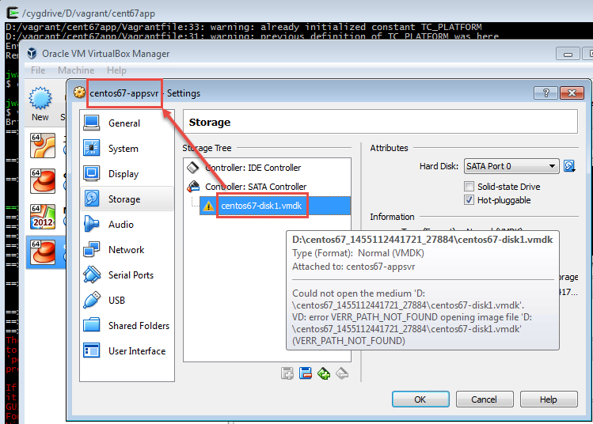

# Overview

Vagrant with Virtual Box supports the ability to rename the default, auto-generated virtual machine name that is covered well in the [StackOverflow post](http://stackoverflow.com/a/20431791/4185948). We use this feature in a manner similar to this...

``` ruby
BOX_NAME = "centos67-appsvr"
  <...snip...>
  # customize VirtualBox defaults
  config.vm.provider "virtualbox" do |vb|
    vb.name = BOX_NAME
  end
```

# Problem

This technique works well on Mac OS X 10.11.3 (El Capitan) using Vagrant 1.8.1 and Virtual Box 5.0.10 & 5.0.14. This technique **fails** on Windows 7 Enterprise SP1 using Vagrant 1.8.1 and Virtual Box 5.0.10 & 5.0.14. 

## Details
1. Vagrant invokes [VBoxManage](https://www.virtualbox.org/manual/ch08.html#idp46730486317136) to rename the machine.
1. The machine name and it's directory name are changed as seen by the VirtualBox GUI
1. The primary disk file is renamed and relocated in the virtual machines subdirectory
1. The virtual machine's configuration is *not* updated correctly as it still references the original generated name for the disk file.
1. Symptoms of this are the red text in the console showing failure at startup:


## Resolution

The resolution to this rename problem under Windows is to manually correct the reference to the attached disk file name using the Virtual Box GUI. In practice, it's a little bit tedious...

1. Start the Virtual Box GUI, highlight the newly added machine name and click the "gear" for settings
1. Choose the Storage section from the left-hand list and you'll see the disk file name with a yellow triangle
1. Right-click the disk file name, choose "Remove" to remove the incorrect image then click OK to close the dialog.
1. Choose "Virtual Media Manager" from the "File" menu (or press Ctrl-D)
1. Find the bad disk image name here and right-click then choose "Remove" and click "Close".
1. Go back to the settings for the virtual machine (you were just in there) and select the SATA controller then click the 2nd icon to the right (the square shaped one with the green plus) and click the middle "Choose existing disk" button. You should see the correct disk file name right there so select it and click OK.
1. Close the Virtual Box GUI, go back to your Cygwin command prompt and run `vagrant up` again.



