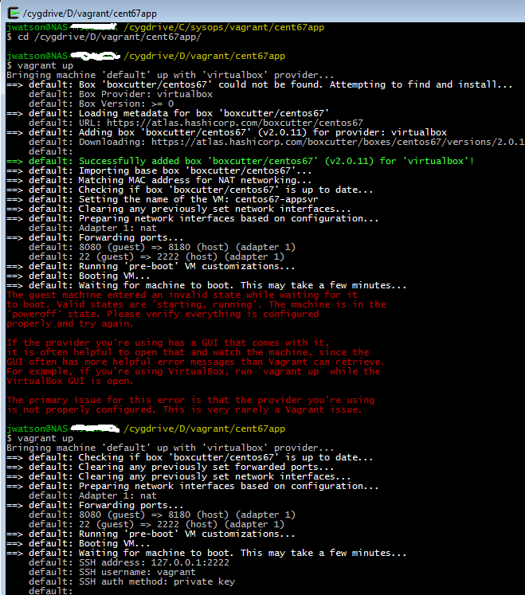

# Overview

This repo contains [Vagrant](https://www.vagrantup.com/) scripts for easily spinning up and automatically provisioning a Windows 8.1 database virtual machine. The heart of these scripts is the [Vagrantfile](https://www.vagrantup.com/docs/vagrantfile/) that contains instructions for the hypervisor defaults for the new instance as well as provisioning steps that are applied automatically when creating a new instance from an image.

# Prerequisites

1. You must have virtualization software installed on your machine. Currently only [Virtual Box](https://www.vagrantup.com/docs/virtualbox/) providers have been coded and tested but [VMware](https://www.vagrantup.com/docs/vmware/) Workstation and Fusion, [Parallels](http://parallels.github.io/vagrant-parallels/docs/), and [Hyper-V](https://www.vagrantup.com/docs/vmware/) providers are also possible (pull requests appreciated if you update & test).
1. You must have [Vagrant](https://www.vagrantup.com/downloads.html) installed.
1. You might need [Cygwin](https://www.cygwin.com/) or [git for Windows](https://git-for-windows.github.io/) installed - necessary as Vagrant uses bash for some of its work.
1. Provisioning scripts expect SQL 2014 unpacked ISO images to be available. These could be converted to variables or otherwise improved upon:
    1. `provisioning\shell\installSQL2014.bat` refers to *SQL2014_x64_ENU* for a folder name - either name your unpacked folder this or change the script

> NOTE: Typically, a collection of installer images are unpacked and mounted in a common location such as on a shared network folder or an attached external hard drive (USB, Thunderbolt, etc.).


# Notes

### Running

To run this script do the following:

  1. Clone this repo somewhere on your disk (`~/vagrant` *or* `%HOMEPATH%\vagrant`)
  1. Open a terminal or command prompt and navigate to the cloned repo (`cd ~/vagrant/win81sql` *or* `cd %HOMEPATH%\vagrant\win81sql`)
  1. Specify value for *iso_mount* (e.g. `iso_mount: "D:/iso"`, `iso_mount: "/Volumes/iso"`, etc.) where installers are located:
     1. Global: you can edit/create `%HOME%\.vagrant.d\Vagrantfile` or `~/.vagrant.d/Vagrantfile` to specify a default value for all Vagrant scripts.
     1. Scoped for just this script: edit `vagrant.yml` in this folder to specify value for just this Vagrant script.
  1. Run `vagrant up`. Optionally you may specify your virtualization provider if not using the defult (virtualbox) `--provider vmware|fusion|hyperv`.
    The first time you run `vagrant up` the provisioning phase will occur and will likely take a couple of hours (sorry, it's Windoze...not me!).
    Subsequently `vagrant up` will simply start your already-provisioned machine.
  1. Run `vagrant rdp` to connect to your newly spun up running instance. *This also works on Mac if you have [Microsoft Remote Desktop](https://itunes.apple.com/us/app/microsoft-remote-desktop/id715768417?mt=12) installed.*
  1. Run `vagrant halt` to issue an orderly shutdown.
  1. Run `vagrant suspend` to save the machine's state to disk (e.g. hibernate) and power off (run `vagrant up` again to restart/restore state).
  1. Run `vagrant destroy` to permanently destroy the image.
  1. Run `vagrant provision` to manually re-run the provisioning phase. This will likely re-install software and re-apply configurations depending on what exactly the provision steps are written to do. NOTE: Since Vagrant must be running for the provision command to work, you may also combine into a single command `vagrant up --provision`.

### Software Provisioning

The base operating system is **Windows 8.1 Enterprise x64** which includes **PowerShell 4**. It is licensed as 'Trial Edition' so you have 90 days grace period to supply your own MSDN developer license for permanent activation (or destroy the machine and re-provision a new image).

The following software will be installed automatically during provisioning phase (intial startup):

1. [Chocolatey](http://chocolatey.org)
1. [Notepad++](https://notepad-plus-plus.org/)
1. [7-zip](http://www.7-zip.org)
1. [SysInternals](https://technet.microsoft.com/en-us/sysinternals/bb545021.aspx)

The following software requires that you provide an unpacked ISO image to install from, see **Configuration Settings**:

1. SQL Server 2014 Developer Edition

### Configuration Settings

The `vagrant.yml` file which sits alongside the standard `Vagrantfile` contains configurable variables that you can customize:

| variable  | purpose |
| --------  | ------- |
| box_name  | The name of the machine assigned in Virtual box (shows in Virtual Box Manager). |
| host_name | The hostname to assign to the guest OS (use `hostname` within the guest OS to see). |
| iso_mount | The physical path on your **host** machine where software installers are located. Will be mounted as `/iso` in the guest OS. |
| v_console | 'true' if you wish to display the hypervisor console window (default is 'false'). |
| v_cpu     | The number of virtual CPUs to assign to the guest machine. |
| v_memory  | The amount of memory to assign to the guest machine. |


### Mount Points

| host | guest | notes  |
| ---- | ----- | ------ |
| "**.**" | `/vagrant` or `C:/vagrant` | Standard `/vagrant` mapping |
| D:/iso | `/iso` or `C:/iso` | Use to access installers from within guest OS during provisioning |

> `vagrant.yml` contains the `iso_mount` variable used to set up the mount point.

### Port Forwarding

| host | guest | notes  |
| ---- | ----- | ------ |
| 1433 | 1433  | SQL Server |
| 3389 | 3389  | Remote Desktop (RDP) |
| 5985 | 5985  | WinRM  |


> Vagrant automatically handles remapping of host ports in the event that a port is already in use. The `vagrant ssh` and `vagrant rdp` commands seemlessly pick up any remapping that may have occurred.

### Known Issues / Workarounds

Vagrant fails during initial startup with the following error:
> 

> You specified `box_name: "somename"` in `vagrant.yml` instead of `default`. Vagrant with Virtual Box supports the ability to rename the default, auto-generated virtual machine name that is covered well in this [StackOverflow post](http://stackoverflow.com/a/20431791/4185948). We use this feature in a manner similar to this...
>
``` ruby
BOX_NAME = "win81x64ent"
  <...snip...>
  # customize VirtualBox defaults
  config.vm.provider "virtualbox" do |vb|
    vb.name = BOX_NAME
  end
```
> This technique works well on Mac OS X 10.11.3 (El Capitan) using Vagrant 1.8.1 and Virtual Box 5.0.10-16. This technique **fails** on Windows 7 Enterprise SP1 using Vagrant 1.8.1 and Virtual Box 5.0.10-16. 

>> 1. Vagrant invokes [VBoxManage](https://www.virtualbox.org/manual/ch08.html#idp46730486317136) to rename the machine.
>> 1. The machine name and it's directory name are changed as seen by the VirtualBox GUI
>> 1. The primary disk file is renamed and relocated in the virtual machine's subdirectory
>> 1. The virtual machine's configuration is *not* updated correctly as it still references the original generated name for the disk file.
>
>The resolution to this rename problem under Windows is to manually correct the reference to the attached disk file name using the Virtual Box GUI. In practice, it's a little bit tedious...
> 
> 1. Start the Virtual Box GUI, highlight the newly added machine name and click the "gear" for settings
> 1. Choose the Storage section from the left-hand list and you'll see the disk file name with a yellow triangle
> 1. Right-click the disk file name, choose "Remove" to remove the incorrect image then click OK to close the dialog.
> 1. Choose "Virtual Media Manager" from the "File" menu (or press Ctrl-D)
> 1. Find the bad disk image name here and right-click then choose "Remove" and click "Close".
> 1. Go back to the settings for the virtual machine (you were just in there) and select the SATA controller then click the 2nd > icon to the right (the square shaped one with the green plus) and click the middle "Choose existing disk" button. You should see the correct disk file name right there so select it and click OK.
> 1. Close the Virtual Box GUI, go back to your command prompt and run `vagrant up` again.
